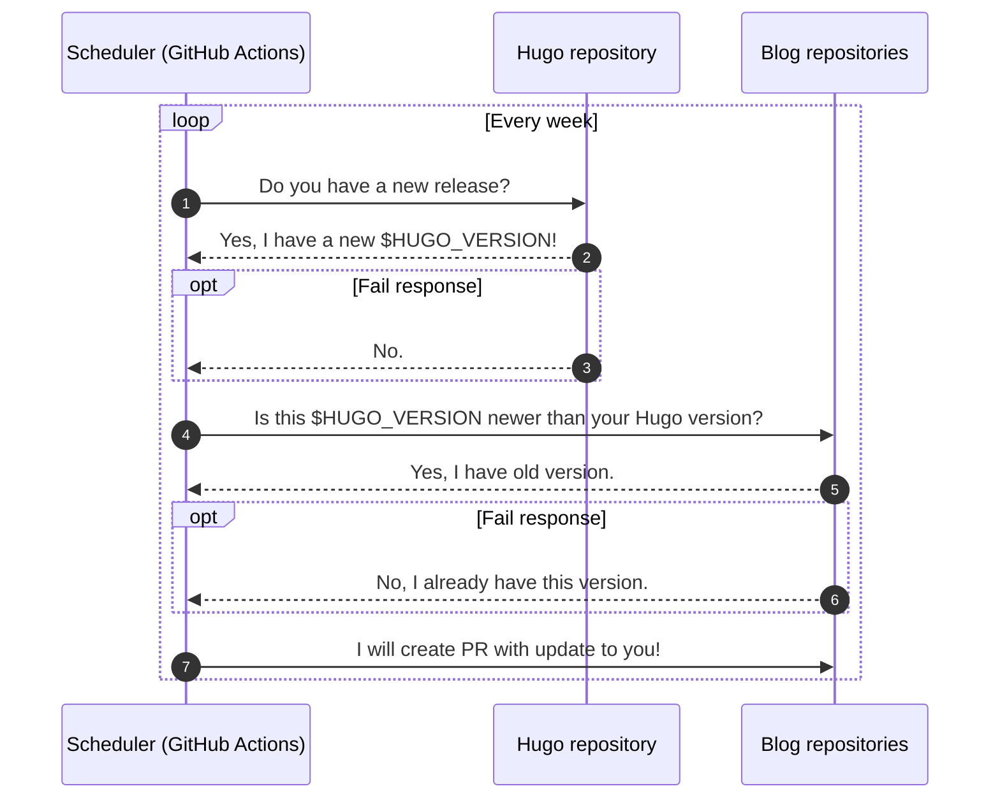

[](https://github.com/abtris/hugo-netlify-autoupdater/actions)
# Hugo Netlify Autoupdater

- using cron for run [.github/workflows/scheduler.yml](https://github.com/abtris/hugo-netlify-autoupdater/blob/master/.github/workflows/scheduler.yml#L4)
- compare current deployed version of Hugo in all blogs
- create PR's for update version `netlify.toml` config
- available settings are in `config.toml` - source repository, target repositories and branch

## Dependencies

- [go-github library](https://github.com/google/go-github)
- [toml library](https://github.com/BurntSushi/toml)
- [go-version](https://github.com/hashicorp/go-version)

### GITHUB_TOKEN

- as `GITHUB_TOKEN` you need [personal one](https://docs.github.com/en/github/authenticating-to-github/creating-a-personal-access-token) that have scope `repo` for all your repositories that you want create PR's. Default in Github Action have access only to current repo.

## Install

```sh
git clone https://github.com/abtris/hugo-netlify-autoupdater.git
cd hugo-netlify-autoupdater
go mod download
```

## Config

Configuration is in `config.toml` file.

```toml
source_repo_releases = "gohugoio/hugo"

[[target_repos]]
  repo = "owner/repo"
  target_file = "netlify.toml"
  target_variable = "HUGO_VERSION"
  branch = "master"
```
## Run

```sh
make run
```

## How that works



## License

MIT
